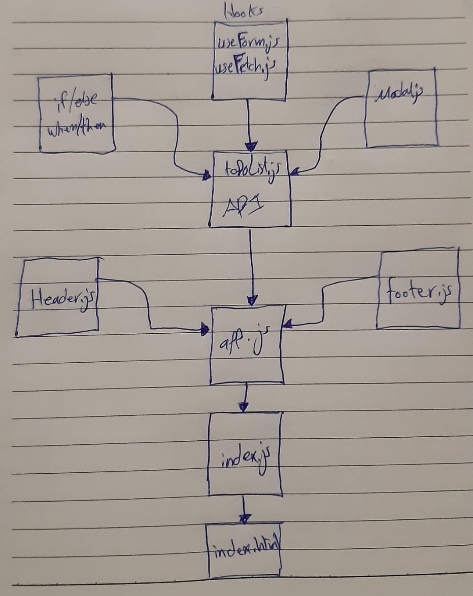

# `<Login />` and `<Auth />`

# LAB - Class 34

### Author: Ahmad Sawalqeh

### Links and Resources

- [submission PR](https://github.com/Ahmad-Sawalqeh/react-hooks-api/pull/4)
- [Deploy React App](https://ahmad-sawalqeh.github.io/react-hooks-api/)
- [Javascript Tests](https://github.com/Ahmad-Sawalqeh/react-hooks-api/runs/492482531?check_suite_focus=true)

### Setup
How to initialize/run your application (where applicable)
* `npm start`
- deployed server link `https://api-js401.herokuapp.com`
- app secret `supersecret`

#### Tests

- How do you run tests?
`npm test`

# UML

